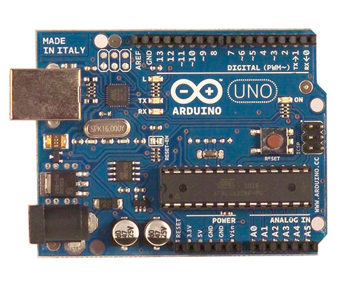

#Introduction to Arduino
This document provides a brief introduction to Arduino and some key concepts.

##什么是Arduino
-  **Arduino**是一个比你的台式电脑更能够用来感应和控制现实物理世界的一套工具。 它由一个基于简易单片机并且开放源码的计算机平台，和一套为Arduino板编写程序 的开发环境组成。
Arduino可以用来开发交互产品，比如它可以读取大量的开关和传感器信号，并且可以控制 各式各样的电灯、电机和其他物理设备。Arduino项目可以是单独的，也可以在运行时和 你电脑中运行的程序（例如：Flash，Processing，MaxMSP）进行通讯。Arduino板你可以 选择自己去手动组装或是购买已经组装好的；Arduino开源的IDE可以免费下载得到。
Arduino是一个基于开放原始码的软硬件平台，构建于开放原始码simple I/O介面版，并且具有使用类似Java、C语言的Processing/Wiring开发环境。

##为什么要使用Arduino？

有很多的单片机和单片机平台都适合用做交互式系统的设计。例如：Parallax Basic Stamp， Netmedia’s BX-24，Phidgets，MIT’s Handyboard 和其它等等提供类似功能的。 所有这些工具，你都不需要去关心单片机编程繁琐的细节，提供给你的是一套容易使用的工具包。 Arduino同样也简化了同单片机工作的流程，但同其它系统相比Arduino在很多地方更具有优越性， 特别适合老师，学生和一些业余爱好者们使用：
 
- 便宜 － 和其它单片机平台相比，Arduino板算是相当便宜了。最便宜的Arduino版本可以自己 动手制作，即使是组装好的成品，其价格也不会超过$50（在中国更便宜）。

- 跨平台 － Arduino软件可以运行在Windows，Macintosh OSX，和Linux操作系统。大部分其它的单片机系统都只能运行在Windows上。
- 简易的编程环境 － 初学者很容易就能学会使用Arduino编程环境，同时它又能为高级用户提供足够多的高级应用。对于老师们来说，一般都能很方便的使用Processing 编程环境，所以如果学生学习过使用Processing 编程环境的话，那他们在使用Arduino开发环境的时候就会觉得很相似很熟悉。
- 软件开源并可扩展 － Arduino软件是开源的，对于有经验的程序员可以对其进行扩展。Arduino编程语言可以通过C++库进行扩展，如果有人想去了解技术上的细节，可以跳过Arduino语言而直接使用AVR C 编程语言（因为Arduino语言实际上是基于AVR C的）。类似的，如果你需要的话，你也可以直接往你的Arduino程序中添加AVR-C 代码。
- 硬件开源并可扩展 － Arduino板基于 Atmel 的ATMEGA8 和ATMEGA168 单片机。Arduino基于Creative Commons 许可协议，所以有经验的电路设计师能够根据需求设计自己的模块，可以对其扩展或改进。甚至是对于一些相对没有什么经验的用户，也可以通过制作试验板来理解Arduino是怎么工作的，省钱又省事。

##Arduino应用实例

- **Arduino的主板**



- **Arduino制作的简易机器人**


- **Arduino的代码片段**

**在主板里写入“hello world”可以在串口监听到“hello world”.**

```void setup()
{```

```Serial.begin(9600);```

```//设置波特率为9600，这里要跟软件设置相一致。当接入特定设备（如：蓝牙）时，我们也要跟其他设备的波特率达到一致。```
```}```

```
void loop()```
```{```

```Serial.println("Hello World!");//显示“Hello World！”字符串```

```delay(5000);// 延迟5秒```

```}
```
