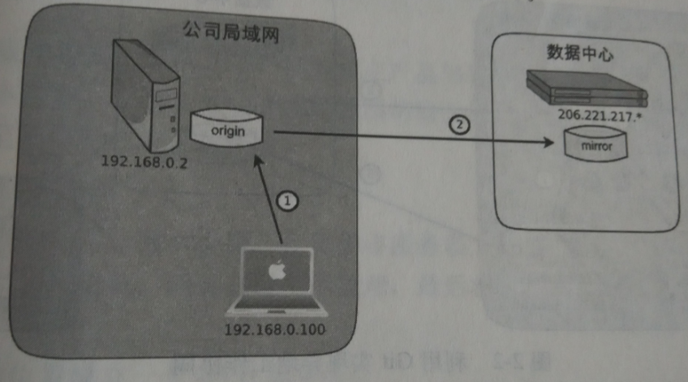

####利用Git做数据的备份：

 

写完一个小节或是画完一张图后，应该执行以下命令提交一次。提交时在本地完成的，因此在途中没有表示出来。

```$ git add -u ```   # 如果创建了新的文件，可以执行git add -i命令。

```$ git commit ```
下班的时候应该执行一次推送

```$ git push ```

图中标记为mirror的版本库就是Git镜像版本库，该版本库只向用户提供只读访问服务，而不能对其进行写操作（推送）。

从图中可以看出，我每日的工作都有三个拷贝，一个在笔记本中，一个在公司内网服务器上，还有一个在外网的镜像版本库中。鸡蛋分别装在了三个篮子里。