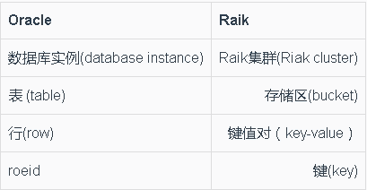

#键值数据库
##键值数据库的定义
>键值数据库（key-value store）是一张简单的哈希表，主要用在所有数据库访问均通过主键来操作的情况下。可把此表想象成传统的“关系型数据库管理系统”，缩写为RDBMS，它有两列。

###Oracle与Raik的比较

流行的键值数据库有：

* Riak[Riak]
* Redis[Redis]
* Memcached DB及其变种[Memcached]
* Berkeley[Berkeley DB]
* Hamster[Hamster DB]
* Amazon DynamoDB
*  Voldemort

在Redis等键值数据库中，所存储的聚合不一定非要是领域对象，任何数据结构都可以。Redis能够存储list、set、hash等数据结构，而且支持“获取某个范围内的数值”（range）、“求差集”（diff）、“求并集”（union）、“求交集”（intersection）等操作。
##键值数据库特性

* [一致性](kconsistency.md)
* [事务](kaffair.md)
* [查询功能](kquery.md)
* [数据结构](kdata_structure.md)
* [可扩展性](kexpansibility.md)
###一致性
* 一致性：用“最终一致性模型”实现“一致性”。

* 两种解决“更新冲突”的办法：
>(1)采纳新写入的数据而拒绝旧数据；
>
>(2)将两者（或存在冲突的所有数据）返回给客户端，令其解决冲突。
###事务
Riak采用“仲裁”来实现事务。在调用QPI时，它使用W值与复制因子N来实现“仲裁”。

>**例、**N=5，W=3,则N-W=2,所以至少要有3个节点汇报写入操作完成，数据库才会认为此操作执行完毕。这样的话Raik就具备了“写入操作容错性”。

###查询功能
* 所有键值数据库都可以按关键字查询，它们的查询功能基本上也仅限于此。

* 副作用是不知道关键字的情况下就没法查询。
* 键值数据库非常适合保存会话。
###数据结构
键值数据库并不关心键值对里的值。它可以是二进制、文本、JSON、XML等。使用Raik时，可在POST请求中用Content-Type指定数据类型。
###可扩展性
很多键值数据库都可用“分片”技术扩展，采用此技术后，键的名字就觉得了负责存储该键节点。
>如a2013001355和b20134444就是两个分别以字母a和b为开头的分片，当集群中的节点数变多时，这种分片设定可提高效率。

分片也会带来一些问题，假如节点a坏了，那么所有存在节点a上的数据将无法访问，页不能再写入其他以a开头的新数据了。
##适用案例

* 存放会话信息
* 用户配置信息
* 购物车数据
##不适场合

* 数据间关系。想在数据间建立关系的情况下不宜用。

* 含有多项式操作的事务。在保存多个键值对时，其中一个关键字出错，需复原或回滚其余操作时，不宜使用。

* 查询数据

* 操作关键字集合。键值数据库一次只能操作一个键，所以无法同事操作多个关键字。