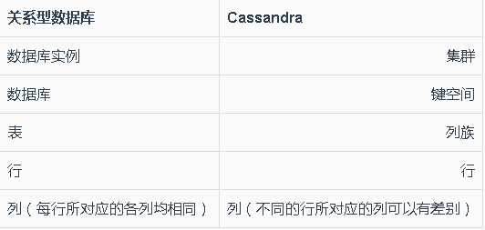

#列族数据库
##列族数据库的定义
列族数据库将数据存储在列族中，而列族数据库里的行则把许多列族数据与本行的”行键“关联起来。

常见的列族数据库有：
* Cassandra
* HBase
* Hypertable
* Amazon DynamoDB

Cassandra的基本单元叫做“列”。它的列由一个“名值对”组成，其中的名字也充当关键字。每个键值对都占据一列，并且都存有一个“时间戳”值。数据过期使用的是时间戳，若某列数据不再用，则用“压缩”来回收空间。

标准列族：列族中的列都是简单列。

超列：某列中包含一个由小列组成的映射表。映射表即为值。超列可视为列容器。

Cassandra将标准列族和超列都放入“键空间”里，键空间与关系数据库里的数据库类似。

注：必须先建立键空间，才可以添加删除列族。