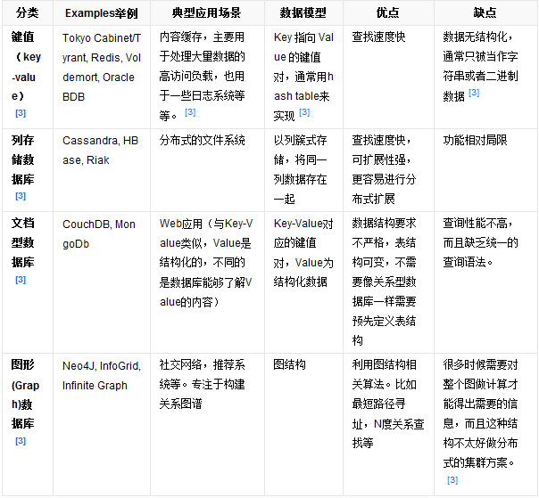

四大NoSQL数据库的比较:

##共同特征
对于NoSQL并没有一个明确的范围和定义，但是他们都普遍存在下面一些共同特征：

* 不需要预定义模式：不需要事先定义数据模式，预定义表结构。数据中的每条记录都可能有不同的属性和格式。当插入数据时，并不需要预先定义它们的模式。

* 无共享架构：相对于将所有数据存储的存储区域网络中的全共享架构。NoSQL往往将数据划分后存储在各个本地服务器上。因为从本地磁盘读取数据的性能往往好于通过网络传输读取数据的性能，从而提高了系统的性能。
弹性可扩展：可以在系统运行的时候，动态增加或者删除结点。不需要停机维护，数据可以自动迁移。

* 分区：相对于将数据存放于同一个节点，NoSQL数据库需要将数据进行分区，将记录分散在多个节点上面。并且通常分区的同时还要做复制。这样既提高了并行性能，又能保证没有单点失效的问题。

* 异步复制：和RAID存储系统不同的是，NoSQL中的复制，往往是基于日志的异步复制。这样，数据就可以尽快地写入一个节点，而不会被网络传输引起迟延。缺点是并不总是能保证一致性，这样的方式在出现故障的时候，可能会丢失少量的数据。
* BASE：相对于事务严格的ACID特性，NoSQL数据库保证的是BASE特性。BASE是最终一致性和软事务。

>NoSQL数据库并没有一个统一的架构，两种NoSQL数据库之间的不同，甚至远远超过两种关系型数据库的不同。可以说，NoSQL各有所长，成功的NoSQL必然特别适用于某些场合或者某些应用，在这些场合中会远远胜过关系型数据库和其他的NoSQL。