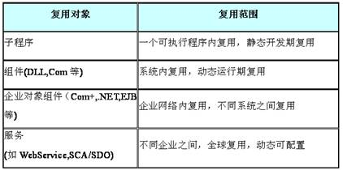

##软件复用
&emsp;&emsp;软件复用，即软件的重用，也叫再用，是指同一事物不作修改或稍加改动就多次重复使用。从软件复用技术的发展来看，就是不断提升抽象级别，扩大复用范围。

SOA的复用：

- 最早的复用技术是**子程序**，人们发明子程序，就可以在不同系统之间进行复用了。但是，子程序是最原始的复用，因为这种复用范围是一个可执行程序内复用，静态开发期复用，如果子程序修改，所有调用这个子程序的系统必须重新编译、测试和发布。

- 为了解决这个问题，人们发明了**组件**（或者叫控件），如MS操作系统下的DLL组件。组件将复用提升了一个层次，因为组件可以在一个系统内复用（同一种操作系统），而且是动态、运行期复用。这样组件可以单独发展，组件与组件调用者之间的耦合度降低。

- 为解决分布式网络计算之间的组件复用，人们发明了**企业对象组件**，如（Com+,.NET,EJB等)，或者叫分布式组件。通过远程对象代理，来实现企业网络内复用，不同系统之间复用。
传统架构的核心是组件对象的管理。但分布式组件也是严重依赖其计算环境，由于构件实现和运行支撑技术之间存在着较大的异构性，不同技术设计和实现的构件之间无法直接组装式复用。

- 而现代SOA的重要特征就是以**服务**为核心，如WebService,SCA/SDO等。通过服务，或者服务组件来实现更高层次的复用、解耦和互操作，即SOA架构中间件。
因为服务是通过标准封装，服务组件之间的组装、编排和重组，来实现服务的复用。而且这种复用，可以在不同企业之间，全球复用，达到复用的最高级别，并且是动态可配置的复用

