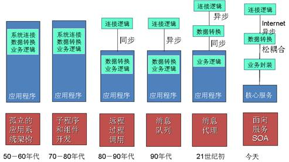

##耦合关系
&emsp;&emsp;传统软件将软件之中核心三部分网络连接、数据转换、业务逻辑全部耦合在一个整体之中，形成“铁板一块”的软件，“牵一发而动全身”，软件就难以适应变化。

&emsp;&emsp;分布式对象技术将连接逻辑进行分离，消息中间件将连接逻辑进行异步处理，增加了更大的灵活性。消息代理和一些分布式对象中间件将数据转换也进行了分离。

&emsp;&emsp;而SOA架构，通过服务的封装，实现了业务逻辑与网络连接、数据转换等进行完全的解耦。

SOA不断解耦的过程：
 

&emsp;&emsp;总之，从科学哲学的角度来看，SOA是一个不断解构的过程，传统软件强调系统性，耦合度过高，所以需要松耦合（解耦）；SOA也是一个组件粒度的平衡，集成电路趋势是集成度越来越高，软件发展的趋势是相反的过程；SOA是架构，更是方法，反映了人们对哲学思想的追求的原动力。