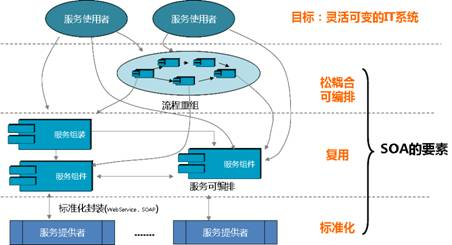

##SOA核心要素

要准确全面理解SOA，首先必须理解SOA的核心要素：

- [标准化封装](21bzhfz.md)

- [复用](22fy.md)

- [松耦合可编排](23sohkbp.md)

&emsp;&emsp;SOA的目标就是实现灵活可变的IT系统。

&emsp;&emsp;要达到灵活性，通过三个途径来解决：标准化封装、复用、松耦合可编排。互操作(标准化封装)、复用、松耦合等SOA技术的内在机制，也是中间件技术和产品的本质特征。