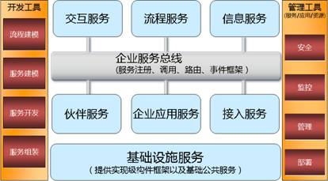

##SOA架构框架
&emsp;&emsp;一个正确的框架，是指导我们开发和实施SOA架构的基础。由IBM提案，国际开放群组(The Open Group)提出了一个SOA架构的参考模型，这个架构框架目前是产业界最权威和严谨的SOA架构标准。

根据这个模型，完整的SOA架构由五大部分组成，分别是：

- [基础设施服务](31fw.md)

- [企业服务总线](32zx.md)

- [关键服务组件](33zj.md)

- [开发工具、管理工具](34gj.md)
