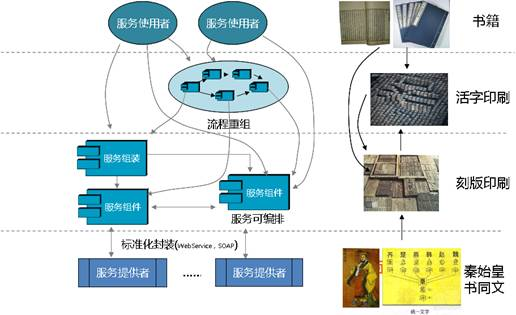

##形象理解SOA

&emsp;&emsp;事实上，SOA的思想我国很早就有了，印刷术的发展过程其思想就完整体现了SOA的核心含义。

&emsp;&emsp;印刷的内容――文字，在秦始皇统一六国之前，各国的文字是不统一的，据说许多常用的文字有十几种写法和读音，妨碍了各国之间的文化交流，就象SOA之前，各种软件平台、各种开发工具和各种接口的组件之间，没有统一的标准，对软件系统之间的整合造成巨大的困难。

&emsp;&emsp;因此，伟大的始皇帝统一了六国文字，“书同文、车同轨”就是通过标准解决“复用”和“互操作”等问题。这也为大规模的印刷和文明发展提供了一个良好的基础，这种“统一封装”的文字，对文化交流起到了一个“互操作”的标准作用。

&emsp;&emsp;在没有印刷术之前，书籍要依赖于手工抄写，这样效率当然是非常低下，而且质量也不能获得一致性的保证，也就是书籍还无法“复用”。中国人首先发明了刻版印刷术，就是将书籍刻成一块一块的凸字版，然后就可以大规模进行印刷了，当印刷出来的书籍脱销时，下次还可以继续使用，大大提高了效率，这就是“复用”，软件通过组件的封装，也可以达到重复和在不同场合多次使用的“复用”效果。

&emsp;&emsp;刻版印刷术有个很大的问题就是文字之间是紧耦合的，同样一个字，在另一部书之中是不能“复用”的，必须重新雕刻，也就是说刻版印刷是没有“编排”特性的。就如软件技术中微软VB开发的Com+组件就只能在Windows环境之中使用，它不能与Java开发的EJB组件进行复用和编排，因为他们与开发环境和运行环境是紧耦合的，要在UNIX环境下使用，必须重新开发（相当于重新“刻版”）。活字印刷就是通过文字与版面之间的松耦合，通过“排版”来实现一部书的印刷版面的，这种松耦合就大大提高了文字的字模之间的复用和编排效率。我们标准封装的“服务”就类似一个一个的字模，通过服务编排（“排版”）来实现业务流程。

&emsp;&emsp;统一文字和活字印刷促进了人类文明进步，而SOA促进全球IT架构和应用的革新。