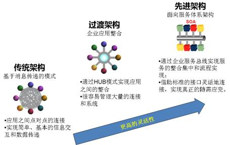

##发展历史
- 概念提出：Gartner（1996），最初由Gartner公司提出，由于当时的技术和市场环境不具备真正实施SOA的条件，因此当时SOA并未引起人们的广泛关注，SOA在当时沉积了一段时间。

- 孕育阶段：XML技术的出现，这一阶段以XML技术为标志，时间大致从上世纪九十年代末到本世纪初。虽然这段时期很少提到SOA,但XML的出现无疑为SOA的兴起奠定了稳固的基石。

- 发轫之初：Web service的出现（2000~）2000年以后，出现了三个著名的Web服务标准和规范：简单对象访问协议、Web服务描述语言、通用服务发现和集成协议，极大地推动了Web服务的普及和发展。

- 成长阶段：从2005年开始，SOA推广和普及工作开始加速。通过建立厂商间的协作组织共同努力制定中立的SOA标准。SCA和SDO构成了SOA编程模型的基础，而WS-Policy建立了SOA组件之间安全交互的规范。这三个规范的发布，标志着SOA进入了实施阶段。

 
SOA架构的发展：

