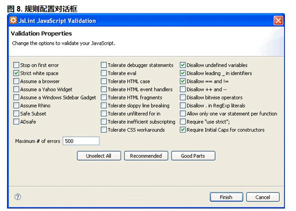
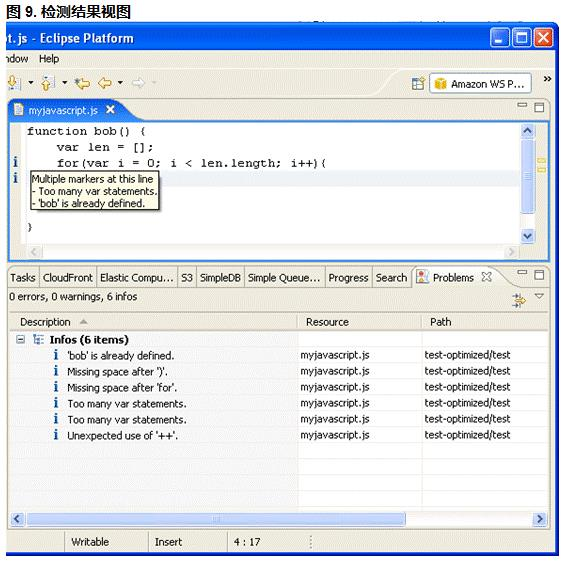

##在 Eclipse 中使用 JSLint

Eclipse 提供了丰富的插件来辅助开发。RockStart 为 Eclipse 提供了 JSLint 插件，以便帮助开发人员在开发过程中实时对所写代码进行检查。

该插件的使用方式十分简单，安装完后，任意在文件内容、文件列表、文件夹上右键单击，都可以出现“Rockstarapps”选项，点击“validate with JSlint”选项即可对目标文件或是文件夹进行 JSLint 的规则检测，并且在检测前，系统会弹出一个规则选取的对话框如图 8 所示，让用户自由配置所需要的规则。设置完毕，点击完成，开发人员便会看到图 9 所示视图，所有当前检测的问题都会在“问题”视图中罗列。

