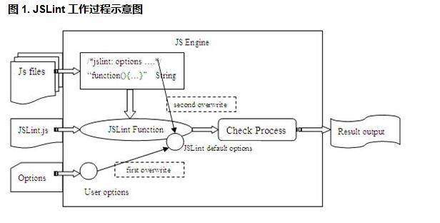

##认识 JSLint 规则

  - 如图所示，规则集的配置方式有三种：

   - 直接通过修改 JSLint.js 源码来修改默认规则。
   - 在 JSLint 函数运行时，同时设置 options 参数，动态改变其规则选项（first overwrite）。此方式适用于对批量 js 文件使用同样的一组自定义规则。
   - 通过在待检测的 js 文件头部添加注释类型的规则，对单个 js 文件添加适用于该文件代码的特殊规则（second overwrite）。此方式适用于对不同 js 文件设置特定的检测规则，通常用于在该文件中引入一些全局变量。