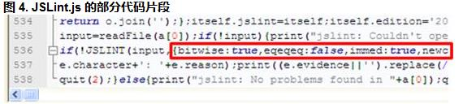

##开始使用 JSLint

最简单直接的使用 JSLint 的方式是下载 Rhino，以命令行方式直接对特定 JavaScript 脚本进行语法检查。Rhino 是 Mozilla 提供的纯 Java 实现的开源 JavaScript 引擎，可在 java 环境中为 JavaScript 提供运行环境。

整个过程可以分为如下几个步骤：

1.确定自定义规则集：这里只使用一个 var 定义所有的变量、不允许使用 ++/-- 运算符、不允许使用 == 运算符，形成的 options:{onevar:true, plusplus:true, eqeqeq=true}。

2.解压 rhino 压缩包，里面包含了 rhino(js.jar) 和 jslint(jslint.js)，我们将 js.jar 添加的操作系统的 classpath 里，方便随处执行；并将 jslint.js 和 test.js 放在一起（当然也可以不放在一起，之后执行的时候键入不同的路径即可）。

3.添加 options 到 JSLint：我们可以选择修改 JSLint 源码或是在待检测的 JavaScript 文件头部添加注释型规则。JSLint.js 源码片段如图4所示，在 536 行 if 语句之后：!JSLINT(input, {[options]}) 是 JSLint 的执行方法，我们的 options 就放在红色方框所在位置；如果要在待测文件头部添加注释类型规则，更加简单，将如下格式的注释添加到待检测 JavaScript 脚本文件顶部即可：
 /*jslint onevar:true, plusplus:true, eqeqeq=true */

