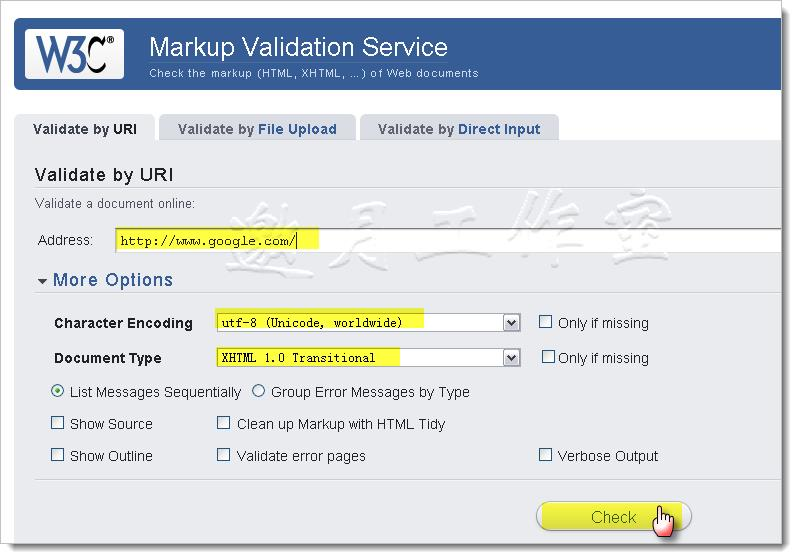
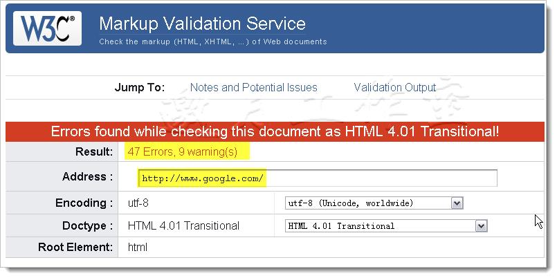
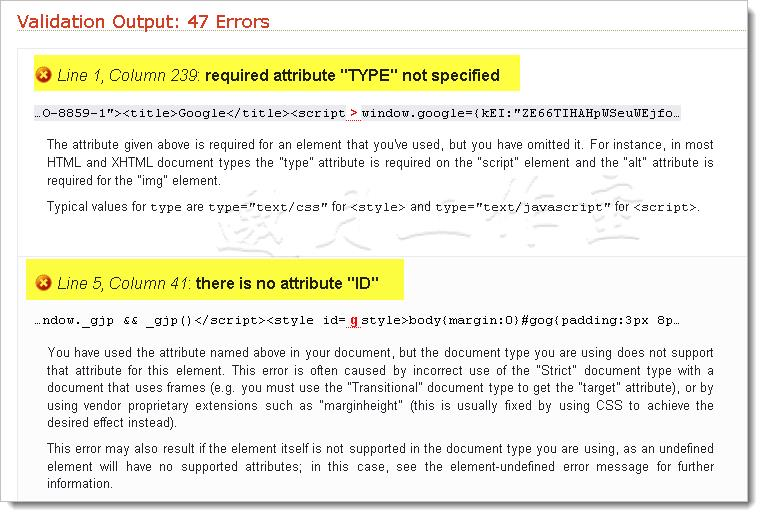

# Markup Validation Service

（标准语法验证）

###用Markup Validation Service进行网页的W3C标准语法验证

W3C提供免费的Markup Validation Service  ，这是一个可以验证Html/XHtml文档的语法规范的公共服务。

**使用方法**

在该页面http://validator.w3.org/ 输入相应的Url即可。

