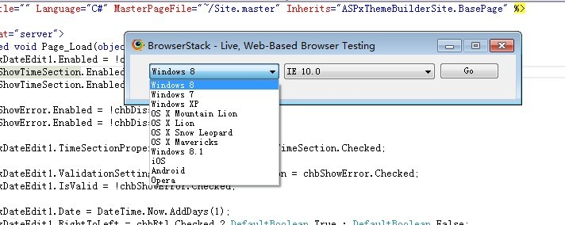
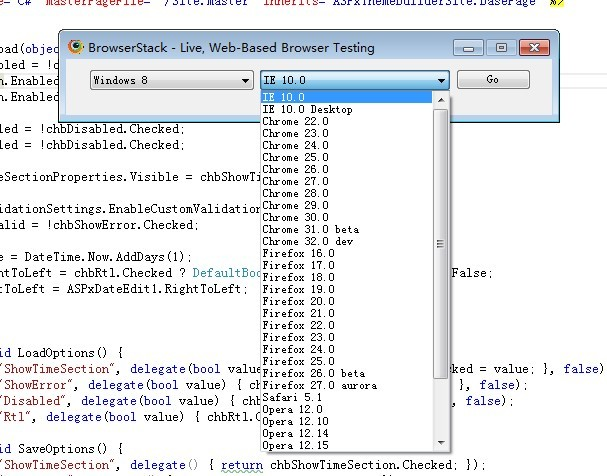
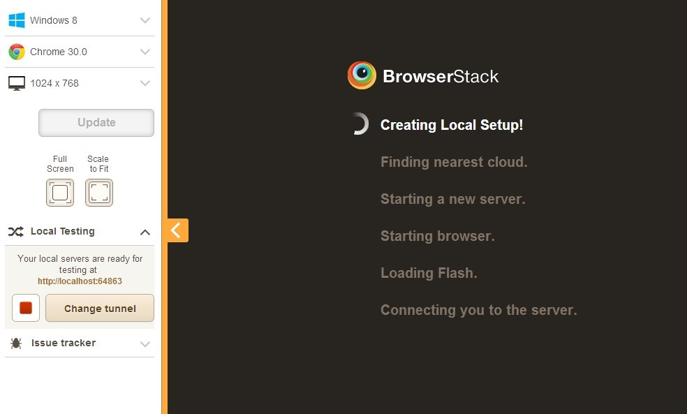
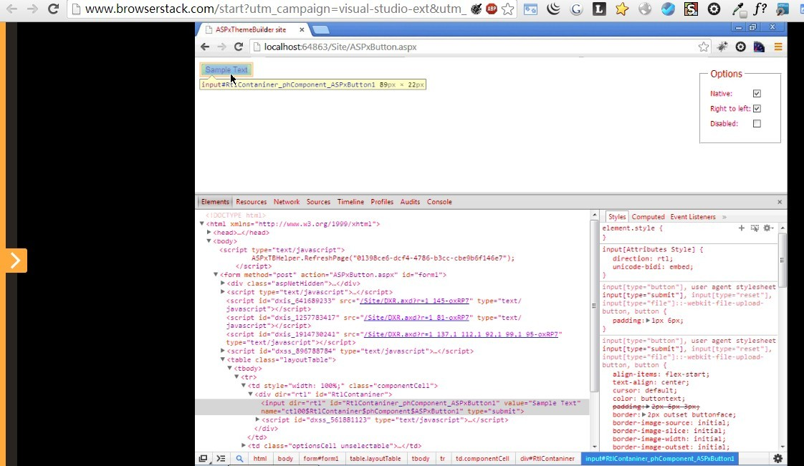

### 使用

安装完毕后，新建一个WebSite 或WebApp在 运行里就能看到已安装的 BrowserStack 来进行选择试用。

选择执行以后，将会弹出一个选择框 让选择“系统”和“浏览器版本” 

选择完后 点击"GO" ，将看到一个初始化页面。左边是你要想要选择的什么样的 测试环境 组合。在页面呈现的时候，可以随时选择随意搭配测试环境。

初始化完后，所看到的跟在IE 或者CHROME浏览器里面看到一样。值得一提的是，在BrowserStack中你照样可以调出IE或CHROME自带的F12开发人员工具对网页进行调试。

