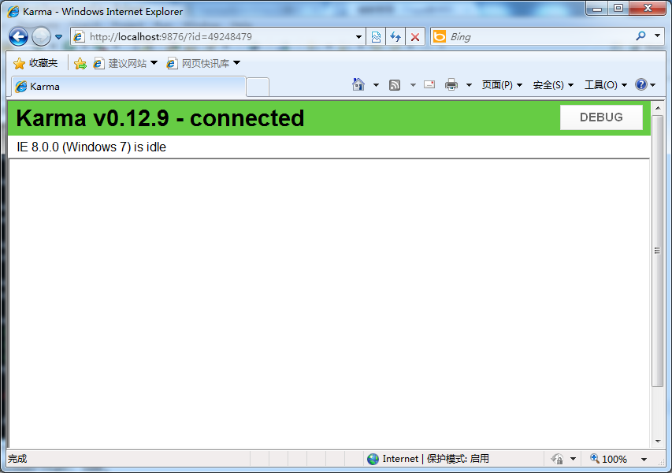

## Karma Runner

### 先装node.js 

    - http://nodejs.org/ 

### 确认node.js安装成功 

    - node -v 

若找不到命令，需设置环境变量，重新打开cmd 
若还是不行，上手动档，命令行里先执行 

    - set Path=%Path%;C:\Program Files\nodejs\  

    - node -v 

不要关cmd

### CMD到项目目录下，安装karma 

http://karma-runner.github.io/0.12/intro/installation.html 

    cd E:\HTML5js\WebContent  

    npm install karma --save-dev  

    npm install karma-jasmine karma-chrome-launcher --save-dev  

    npm install -g karma-cli 

有时会提示什么.dll类库找不着，请安装visual studio 2010，安装visual studio 后，再重新执行npm安装命令。

### 运行karma测试命令是否正常 

    - karma start 

有时可能又运行不了，那么 

    - node ./node_modules/karma/bin/karma start 

### 编写配置文件 

在当前目录下添加karma.conf.js 

>01 module.exports = function(config) {  
02   config.set({  
03     // base path, that will be used to resolve files and exclude  
04     basePath: '.',  
05    
06     frameworks: ['jasmine'],  
07    
08     // list of files / patterns to load in the browser  
09     files: [  
10       'js/*.js' 
11     ],  
12    
13     // list of files to exclude  
14     exclude: [  
15       'client/main.js' 
16     ],  
17    
18     preprocessors: {  
19     },  
20    
21     // use dots reporter, as travis terminal does not support escaping sequences  
22     // possible values: 'dots', 'progress'  
23     // CLI --reporters progress  
24     reporters: ['progress', 'junit'],  
25    
26     junitReporter: {  
27       // will be resolved to basePath (in the same way as files/exclude patterns)  
28       outputFile: 'test-results.xml' 
29     },  
30    
31     // web server port  
32     // CLI --port 9876  
33     port: 9876,  
34    
35     // enable / disable colors in the output (reporters and logs)  
36     // CLI --colors --no-colors  
37     colors: true,  
38    
39     // level of logging  
40     // possible values: config.LOG_DISABLE || config.LOG_ERROR || config.LOG_WARN || config.LOG_INFO || config.LOG_DEBUG  
41     // CLI --log-level debug  
42     logLevel: config.LOG_INFO,  
43    
44     // enable / disable watching file and executing tests whenever any file changes  
45     // CLI --auto-watch --no-auto-watch  
46     autoWatch: true,  
47    
48     // Start these browsers, currently available:  
49     // - Chrome  
50     // - ChromeCanary  
51     // - Firefox  
52     // - Opera  
53     // - Safari (only Mac)  
54     // - PhantomJS  
55     // - IE (only Windows)  
56     // CLI --browsers Chrome,Firefox,Safari  
57     //browsers: [process.env.TRAVIS ? 'Firefox' : 'Chrome'],  
58     browsers: ['IE'],  
59    
60     // If browser does not capture in given timeout [ms], kill it  
61     // CLI --capture-timeout 5000  
62     captureTimeout: 20000,  
63    
64     // Auto run tests on start (when browsers are captured) and exit  
65     // CLI --single-run --no-single-run  
66     singleRun: false,  
67    
68     // report which specs are slower than 500ms  
69     // CLI --report-slower-than 500  
70     reportSlowerThan: 500,  
71    
72     plugins: [  
73       'karma-jasmine',  
74       'karma-chrome-launcher',  
75       'karma-firefox-launcher',  
76       'karma-ie-launcher',  
77       'karma-junit-reporter',  
78       'karma-commonjs' 
79     ]  
80   });  
81 }; 
 
### 添加需要测试的js和测试用例 

创建js目录，在js目录下创建 plus.js和test.js 

**plug.js源码** 

>// Some code under test  
  function plus(a, b) {  
   return a + b;  
 } 

**test.js源码** 

> describe('plus', function() {  
   it('should pass', function() {  
     expect(true).toBe(true);  
   });      
   it('should work', function() {  
     expect(plus(1, 2)).toBe(3);  
   });        
   it('should work', function() {  
         expect(plus(5, 2)).toBe(9);  
       });  
 }); 

### 执行测试 

在当前目录下运行命令，启动测试： 

     karma start 

若测试不成功，安装karma插件 

>   npm install karma-chrome-launcher karma-firefox-launcher karma-ie-launcher karma-junit-reporter karma-commonjs --save-dev 

安装好后，再执行karma start进行测试

命令行显示测试结果 

>E:\HTML5js\WebContent>node ./node_modules/karma/bin/karma start  
 INFO [karma]: Karma v0.12.9 server started at http://localhost:9876/  
 INFO [launcher]: Starting browser IE  
 INFO [IE 8.0.0 (Windows 7)]: Connected on socket eltz_MLU0QZG0nXCcquR with id 46 
 729579 
 ..  
 IE 8.0.0 (Windows 7) plus should work FAILED  
         Expected 7 to be 9.  
 IE 8.0.0 (Windows 7): Executed 3 of 3 (1 FAILED) (0.023 secs / 0.013 secs) 

自动打开IE进行测试，IE界面：

