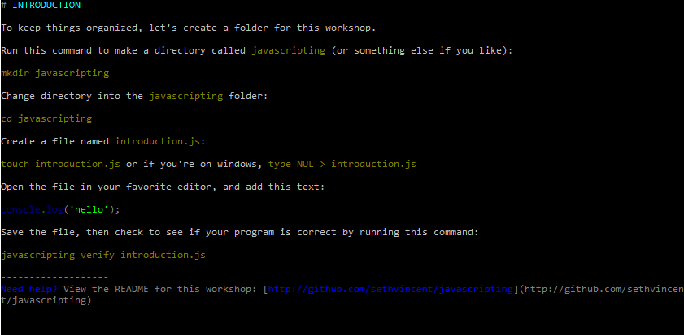
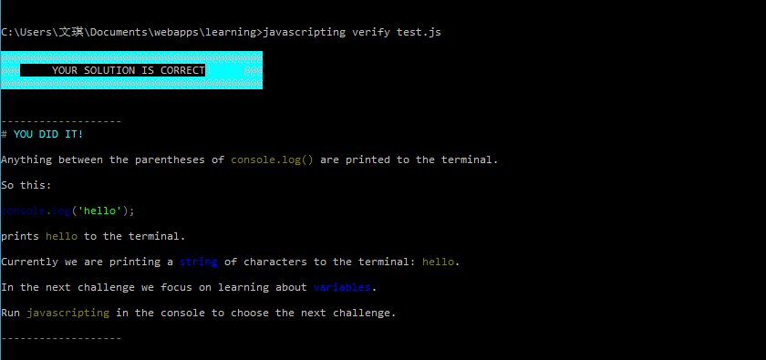

# 任务：Introduction

## 领取任务

1. 运行javascripting

    在命令行窗口运行：`javascripting`

2. 选择 `INTRODUCTION`，并按回车：

    

3. 阅读说明后按回车键退出

## 编写代码

1. 创建代码文件

    使用 `type NUL > intro.js` 或其他方式创建一个名为`intro.js`（也可以为其他名字）的文本文件

2. 打开`intro.js`文件，并按任务要求键入代码：
    ```
    console.log('hello');
    ```
3. 保存并关闭`intro.js`文件

4. 测试代码是否正确
    1. 在命令行窗口运行：`node intro.js`
    2. 如果出现 `hello`则证明代码正确。

## 验证代码

1. 在命令行窗口运行：`jvascripting verify intro.js`

2. 出现下面画面则证明代码正确

    

3. 若不出现以上画面，则证明代码有误