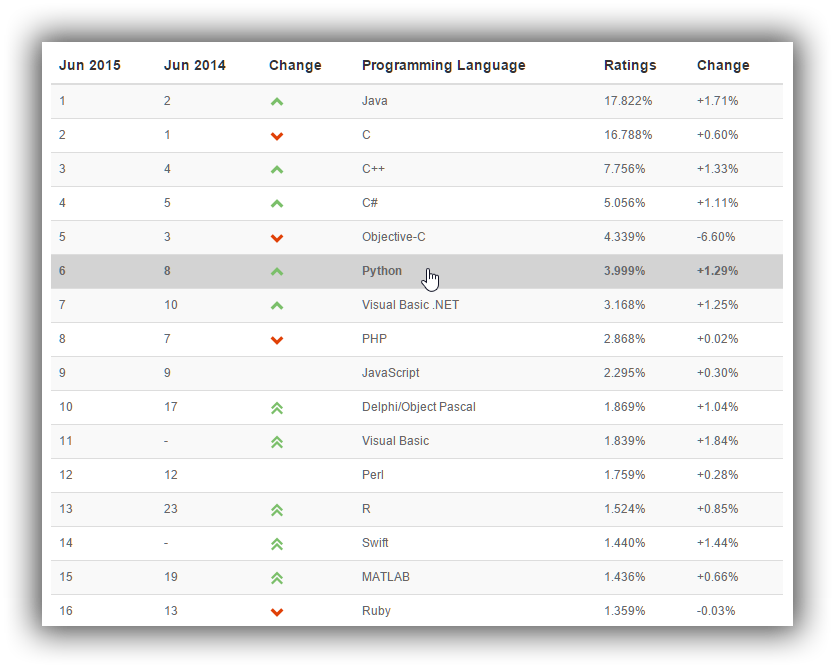
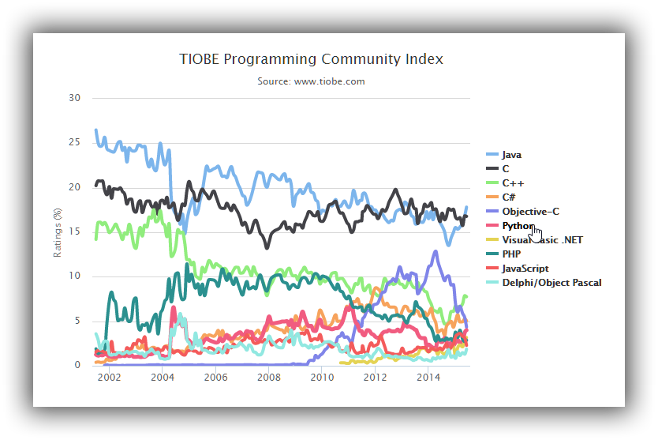

# Python是什么

Python是一门语法简洁清晰、具有强大类库的动态类型的脚本语言。

### 设计哲学

> Python的设计哲学是“优雅”、“明确”、“简单”。因此，Perl语言中“总是有多种方法来做同一件事”的理念在Python开发者中通常是难以忍受的。Python开发者的哲学是“**用一种方法，最好是只有一种方法来做一件事**”。在设计Python语言时，如果面临多种选择，Python开发者一般会拒绝花俏的语法，而选择明确的没有或者很少有歧义的语法。由于这种设计观念的差异，Python源代码通常被认为比Perl具备更好的可读性，并且能够支撑大规模的软件开发。这些准则被称为Python格言。

### 语言特性

Python是完全**面向对象**的语言。函数、模块、数字、字符串都是对象。并且完全支持继承、重载、派生、多继承，有益于增强源代码的复用性。

### 非常好的可扩展性

Python本身被设计为可扩充的。并非所有的特性和功能都集成到语言核心。Python提供了丰富的API和工具，以便程序员能够轻松地使用C/C++来编写扩充模块。Python编译器本身也可以被集成到其它需要脚本语言的程序内。因此，很多人还把Python作为一种“胶水语言”（glue language）使用。

### 快速的开发效率

使用Python开发时效率是很高的，完成一个相同的功能可能用C编写需要1000行代码，用Java需要100行代码，用Python只需要10行代码（这只是一种大概的预估），但运行效率上，可能C只需要1s，Java需要2s，Python需要3s。

当然，随着计算机运行效率、硬件、Python优化的提升，在大多数情况下，快速的开发有优先于执行的效率，所以Python还是有在很多领域内被广泛的使用。

一些运行效率非常注重的场所就不适宜（完全）用Python来做，可以使用C/C++或者把部分模块用C/C++重写，然后使用Python来调用

### TIOBE编程语言排行榜

最近的排行榜，详见[TIOBE Index](http://www.tiobe.com/index.php/content/paperinfo/tpci/index.html)

